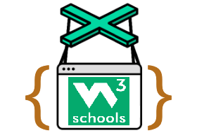

> 
# W3School Javascript Glossary
> [!NOTE]
> This is the official large name for W3SjsGlossary

> ## This Project aim to scrape all the [W3School](https://www.w3schools.com/jsref/) website
>  for extract , simplify, format and save the requested queries about JS

> ## How to Install W3SjsGlossary
> 1 - Clone or download the repo\
> 2 - Go inside W3SjsGlossary folder an then run in your terminal\
> `npm install`
 
> [!IMPORTANT]
> You need to have installed [Node JS](https://nodejs.org/en) to run `npm` \
> and [Chrome](https://www.google.com/intl/es_us/chrome/) or [Chromium](https://www.chromium.org/getting-involved/download-chromium/) to use puppeteer 

> ## For Run W3SjsGlossary
>  `npm run search <javascript_method>`
> replace <javascript_method> with the requested method to search
  
> [!TIP]
> If you want run seeing all that the browser is doing
> change the `boolean` value of key `headless` to `false` inside `constant browser`
> You can change the `string` value of key `executablePath` to your Chrome/Chromium executable path
> `const browser = await puppeteer.launch({` \
> `executablePath: "C:/Program Files/Google/Chrome/Application/chrome.exe",` \
> `headless: true,` \
> `defaultViewport: null,` \
> `});`

> ### Take note you can always visit the official puppeteer documentation for future modifications
> ### [Documentation](https://pptr.dev/guides/what-is-puppeteer)

> ### The Output will show :
> 
